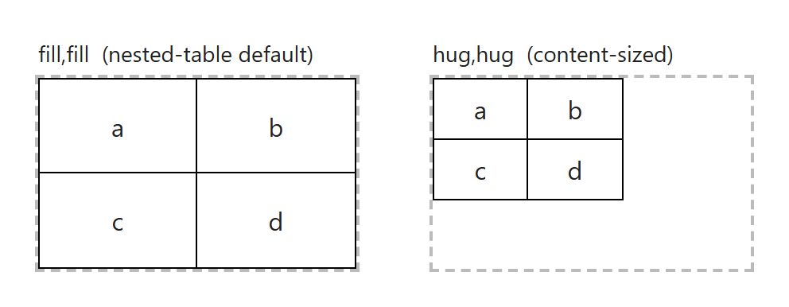

# Finding (3): coupled inner borders & nested-table default sizing

While proving that every design sample could be **built through the toolbar UI** (Phase 2 of
the design loop), two places came up where what the controls produce doesn't line up with a
natural authoring intent. Neither blocks anything — both have clean workarounds, which the
sample recipes use — but both are good candidates for a UX refinement. This document explains
both in detail.

> Context: `tests/samples/NOTES.md` (loop log) and `tests/samples/ui/DSL.md` (how samples are
> built through the UI).

---

## A. The border control couples the two interior directions

### Background: the edge model

bloom-table draws lines on **edges**, not on cells. Every table has:

- **perimeter edges** — the outer frame (top / right / bottom / left), and
- **interior edges** — the lines *between* cells. These come in two directions:
  - **interior horizontal** edges = the lines between **rows** (they run left↔right), and
  - **interior vertical** edges = the lines between **columns** (they run up↕down).

```
            top (perimeter)
          ┌───────┬───────┐
   left   │       │       │   right        ── interior horizontal edge (between rows)
 (perim.) ├───────┼───────┤   (perim.)     │  interior vertical edge (between columns)
          │       │       │
          └───────┴───────┘
            bottom (perimeter)
```

(In the data model these are `data-edges-h` and `data-edges-v`; see
[src/table-renderer.ts](../src/table-renderer.ts) and [design/model.md](model.md).)

### The control

The **Border** control (Table section) is a small SVG with **five** clickable targets — the
four perimeter bars and a single inner **"+"**:


You **select** one or more targets, then choose a Style and Weight, which are applied to the
selected edges.

**The key behaviour:** the inner **"+"** is a *single* target. Clicking it toggles **both
interior directions at once** — the horizontal-between-rows lines *and* the vertical-between-
columns lines together. There is no way, at the table level, to select *interior verticals
only* or *interior horizontals only*.

(Code: in [src/components/BorderControl/BorderSelector.tsx](../src/components/BorderControl/BorderSelector.tsx)
the inner group calls `toggle("inner")`, which flips **all** of `InnerEdges` = `["innerH","innerV"]`.)

### Why it matters

Several primer designs use **vertical rules only** — columns separated by lines, with no
horizontal lines and no frame. For example sample 02 (and the word block in sample 95):

```
   sinini │ sinini │ sinini        ← only the two interior VERTICAL rules
   si-ni-ni │ si-ni-ni │ si-ni-ni     (no frame, no horizontal lines)
   si       │ si       │ ni
   s        │ i        │ n
```

The inner **"+"** can't express this: selecting "inner" and applying a style would also draw
the horizontal lines between every row.

### Workaround (used by the recipes)

Draw the rule as the **right border of each cell** in the divider column(s), using the *cell*
border control (which only has perimeter edges). For a 3-column block that means setting the
right border on every cell in columns 0 and 1. This resolves to exactly the same per-cell
border model as the design. See `tests/samples/02.recipe.ts`.

### Recommendation

Split the inner **"+"** into **two independently-clickable bars** — one for interior-horizontal,
one for interior-vertical. The selector already *draws* them as two separate `<rect>`s (the
horizontal bar and the vertical bar of the "+"), so this is mostly wiring: give each inner rect
its own `onClick`/selection state instead of the shared `toggle("inner")`. Keep a convenience
"both" affordance if desired (e.g. a modifier-click, or a third hit-area at the center). Then
"verticals only" / "horizontals only" become a single click, and sample 02 becomes buildable
directly at the table level.

---

## B. Nested tables default to `fill,fill`, not `hug`

### What happens

When you change a cell's **content type to "table"**, a 2×2 nested table is inserted using this
template (in [src/cell-contents.ts](../src/cell-contents.ts)):

```html
<div class='table' data-column-widths='fill,fill' data-row-heights='fill,fill'> … </div>
```

So a freshly-embedded table **stretches to fill its parent cell**. A *top-level* table (the
demo's blank starter) instead defaults to `hug,hug` (size-to-content). The two defaults differ.

The difference, with identical content in the same-size box:



- **`fill,fill`** (left): the 2×2 expands so its rows/columns fill the whole box.
- **`hug,hug`** (right): the 2×2 shrinks to its content and sits at the top-left.

### Why it matters

The composite designs (06, 07, 10, 95) place **content-sized** sub-tables inside cells — e.g.
the small letter grids, the rounded letter boxes, the ruled word block. With the `fill` default,
each embedded table's tracks stretch to the parent cell instead of hugging their text, so the
sub-table looks wrong until it's resized. Every nested table in those recipes needed an explicit
"hug" pass. It's also simply **inconsistent**: top-level default = `hug`, nested default = `fill`.

### Workaround (used by the recipes)

After creating a nested table, set its columns/rows to **Hug** (the Size control) before filling
it in. See the `columnSize(_, "hug")` / `rowSize(_, "hug")` calls in `tests/samples/10.recipe.ts`
and `95.recipe.ts`.

### Recommendation

Default the nested-table template to **`hug,hug`**, matching the top-level default and the more
common "size to content" intent. If some consumer relies on embedded tables filling their cell
(e.g. existing Bloom documents), gate it behind a flag or provide a one-time migration rather
than changing it silently.

---

## Summary

| | Issue | Workaround today | Suggested fix |
|---|---|---|---|
| **A** | Inner border **"+"** toggles horizontal + vertical interior lines **together** | Set the rule as a per-**cell** right/bottom border | Split the inner "+" into two independent bars (H, V) |
| **B** | Embedded tables default to **`fill,fill`** (stretch), unlike top-level **`hug,hug`** | Recipe sets nested tracks to **Hug** explicitly | Default the nested template to `hug,hug` |

*(The illustration images are regenerated from `tests/samples/_doc-nested.html` and the editor
harness; see the capture notes in `tests/samples/README.md`.)*
